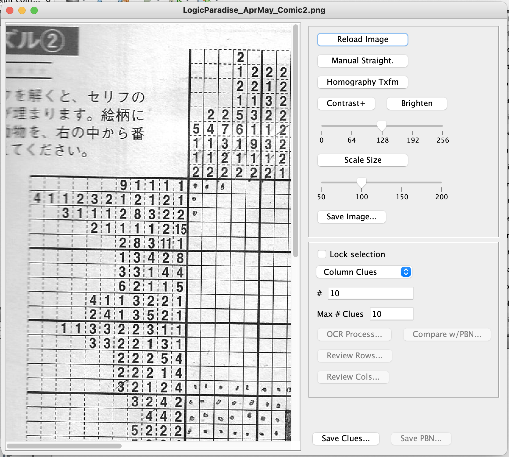
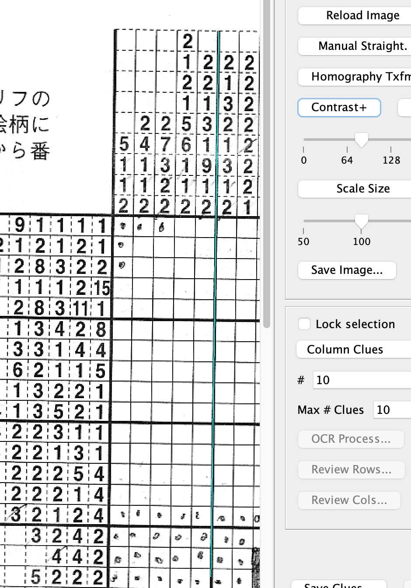
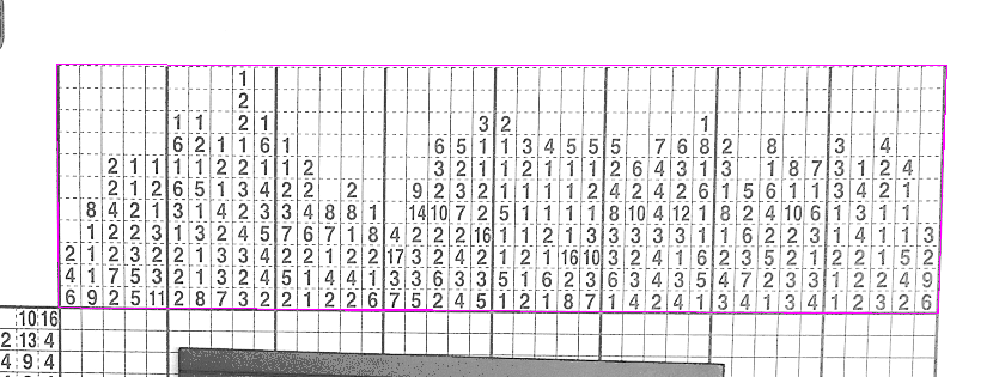

# PaintByNumber_OCR
Java program to scan a Nonogram .tiff (or other image format) and assist the user in extracting the puzzle clues using OCR and writing those clues into a text file format compatible with PaintByNumberPro.

# Instructions for Use

## Importing the puzzle image

When you first run the program, you will be immediately asked to select an image to load.  You will have an easier time with the OCR processing if you use a flatbed scanner for your puzzle (or a screen capture).  You can take a photo of the puzzle, but the paper needs to be as flat as possible for good results.  And the lens distortion should be minimal.

Note that you do not need to scan in an entire puzzle all at once.  You can scan in portions of the clues and write out portions of the clues, combining them later into a single file to be used with PaintByNumberPro.

As a note, I've been scanning the puzzles in black and white at 200 dpi.  You can use photos, but you may need to scale them to a smaller size if they're too big to work with easily.  This can be done in this OCR program.

## Main Interface

After the image has been loaded, your main interface will look like this: 



### Rotate the image

In this example, the image was scanned on a flatbed scanner and just needs to be rotated.  To do so, hold the SHIFT key and left-click-and-drag a line that needs to be made vertical:



Then click on the `Manual Straight.` button.

### Use homography transform

If you took a photo of your puzzle, then it likely needs more than just rotating to get the clues lined up in a nice rectangle.  Hold down the CTRL key and left-click the four corners of the area you would like to straighten out:



# Development Environment
This program was developed on an Intel 2016 MacBook Pro using Java 8 and NetBeans 8.2.

To find Java 8 JDKs for Mac and PC, click here [Java 8 Archive](https://www.oracle.com/java/technologies/javase/javase8u211-later-archive-downloads.html).  To find NetBeans 8.2 for PC, you can find it here [lucky link to NetBeans 8.2](https://softfamous.com/netbeans-ide/).  For the Mac, it may be possible to install older versions of NetBeans using homebrew:

```
brew tap homebrew/cask-versions
brew search netbeans
brew info --cask netbeansXX
brew install --cask netbeansXX
```

where `netbeansXX` is the version you are looking to install.  `brew search netbeans` returns a list of available casks related to netbeans.  When I tried this on my Mac, I see that only the latest version 12.5 is available.

## Installing Tesseract OCR for Mac or PC with Java Interface
Tesseract OCR is used for extracting the puzzle clues from the scanned Nonogram.  It seems that I have the native library installation via homebrew and the Java interface from Tess4J.  I believe I downloaded Tess4J from SourceForge here: [SourceForge Tess4J download](https://sourceforge.net/projects/tess4j/).  And my homebrew version is 4.1.0.  There are newer versions of Tesseract available now (v5) and I'm not sure if Tess4J will work with these newer versions.

## Tess4J and NetBeans
Once you download the Tess4J package, you'll see the following folders:

- dist (contains the .jar file you need)
- lib (contains all the other .jar files you need plus the native libraries)
- nbproject
- src
- tessdata (contains the English training data you need, though I used the training data installed by homebrew)
- test

The Tess4J folder is configured as a NetBeans project.  In NetBeans, you can load the Tess4J folder as a project.  In theory, you should be able to run the JUnit tests by right-clicking on the project icon and select "Test...".  This worked flawlessly on my PC as long as I did not store the Tess4J folder on my OneDrive folder (which has spaces in the full path name).  I'm not sure if it was the spaces in the folder that mattered or if the fact that it was stored in the cloud that mattered.

On my Mac, Tess4J does not contain the appropriate native libraries.  But I was able to install tesseract using homebrew.  So I am able to use the Java interfaces from Tess4J with the tesseract native libraries in homebrew without having to set up the java.library.path on the JVM command line.  (I'm probably also using a conveniently compatible version of tesseract).  I was not able to run the JUnit tests on my Mac for some reason because it could not find the native libraries. I have not pursued fixing this problem because my code was working.

Note that for this program, PaintByNumber_OCR, you can set the TessDataLocationDefault static String in `PaintByNumber_OCR.java` for your system.  The other option is to provide the tessdatapath property in the "Run" "VMOptions:" (e.g. `-Dtessdatapath=<your_local_path_to_tessdata>`).

## Tesseract Example in Java / NetBeans
Here is a quick example of how to use Tesseract OCR in Java.  You can create this sample program within the Tess4J Netbeans project and see if it will run.

```
package sample_program;

import java.awt.image.BufferedImage;
import java.awt.FileDialog;
import java.awt.Graphics;
import java.io.FilenameFilter;
import java.io.File;
import java.io.IOException;
import javax.imageio.ImageIO;
import net.sourceforge.tess4j.Tesseract;
import net.sourceforge.tess4j.TesseractException;

public class Tess4J_Example {
    
    public Tess4J_Example()
    {
        final String[] formats = ShowImageIOInfo();        
	    
        // ---- Have user select a TIFF image ----
        FileDialog fd = new FileDialog((java.awt.Frame) null, "Select a TIFF image for OCR", FileDialog.LOAD);
        fd.setFilenameFilter (new FilenameFilter ()
        {
            public boolean accept (File f, String name)
            {
                String extension = name.substring(name.lastIndexOf("."));
                if (extension == null) return false;
                for (int i=0; i<formats.length; i++)
                    if (extension.compareTo ("." + formats[i]) == 0) return true;
                return false;
            }
        });
        fd.setVisible(true);
        if (fd.getFile() == null) return;
        File f = new File(fd.getDirectory(), fd.getFile());
		
        // ---- Read image ----
        BufferedImage color_img = null, grey_img = null;
        try
        { color_img = ImageIO.read(f); } 
        catch (IOException ie)
        {
            System.out.println ("IOException: " + ie.getLocalizedMessage());
            return;
        }        
        if (color_img == null) return;
		
        // ---- Convert to greyscale ----
        grey_img = new BufferedImage(color_img.getWidth(), color_img.getHeight(), BufferedImage.TYPE_BYTE_GRAY);  
        Graphics g = grey_img.getGraphics();  
        g.drawImage(color_img, 0, 0, null);  
        g.dispose();  		
		
        // ---- Set up Tesseract and run the OCR ----
        Tesseract tess = new Tesseract();
        tess.setDatapath("/usr/local/Cellar/tesseract/4.1.1/share/tessdata");	
        tess.setTessVariable("tessedit_char_whitelist", "0123456789");
        try
        {
            String ocr_out = tess.doOCR (grey_img);      
            System.out.println ("OCR output: " + ocr_out);
        }
        catch (TesseractException tioe)
        { System.out.println ("TesseractException: " + tioe.getLocalizedMessage()); }
    }
    
    public String[] ShowImageIOInfo () {
        String[] formats = ImageIO.getReaderFormatNames();
        for (int i = 0; i < formats.length; ++i) {
          System.out.println("reader " + formats[i]);
        }

        String[] names = ImageIO.getWriterFormatNames();
        for (int i = 0; i < names.length; ++i) {
          System.out.println("writer " + names[i]);
        }
        
        return formats;
    }        
    
    /*======================================*
    * Entry Point                          *
    *======================================*/

    public static void main(String[] args)
    {   
        Tess4J_Example te = new Tess4J_Example();
    }
}
```

## Installing OpenCV for Mac or PC with Java Interfaces
On a PC, it is easy to get OpenCV with Java interfaces.  Click on this link [OpenCV Releases](https://opencv.org/releases/) to download the complete package for OpenCV.  The Java interfaces are contained within the build/java folder and the native libraries are in the build/java/x86 and build/java/x64 folders.

Getting OpenCV installed on my Intel MacBook Pro was a little more difficult.  You can use homebrew to install OpenCV, but it no longer supports building the Java interfaces.  So I ended up trying to install OpenCV from source and building it locally on my machine.  I used instructions from here: [OpenCV 4 with Java instructions](https://delabassee.com/OpenCVJava/) by David Delabassée.

I already had XCode and Java 8 installed on my Mac so I started with creating a landing space for OpenCV and downloading the source from GitHub:

```
mkdir workspace;cd workspace
git clone https://github.com/opencv/opencv.git
mkdir build
```

I used ccmake to create the make file.

```
ccmake -S opencv/ -B build/
```

Following the directions, navigate through the various options using the "j" and "k" keys (or your scroll wheel) for moving down and up through the options.  Options can be turned on and off by hitting the space bar or edited by hitting Enter.  Press "t" to enter Advanced Mode.  Advanced Mode was necessary to be able to configure some of the more obscure settings for Java.  Be sure to set the Java environment variables noted on the webpage.  After you have chosen your settings, type "c" to configure.

David Delabassée has a list of suggested modules to omit for a faster build and for just getting started.  I did try building the image codecs and calib3d, but was not able to get it to actually build, having run into some kind of problem with building zlib.  If I use only the basics of OpenCV, I can get the whole thing to build.  But anything requiring zlib is a problem.  UPDATE: this [OpenCV config reference](https://docs.opencv.org/4.5.3/db/d05/tutorial_config_reference.html) was very helpful.  It clued me into the fact that enabling "BUILD_ZLIB" meant that I wanted to build zlib from source (from the 3rdparty folder).  I had zlib already installed with homebrew, so when I turned this option off, OpenCV was built successfully.  Yay!

When you have finished setting up your options and the configuration executes without error, press "g" to generate the Makefile.  Any errors in your configuration will be noted with an asterisk (*).

Once the Makefile is generated, exit ccmake and then build OpenCV using:

```
cmake --build build
```

Presumably all goes well and you now have OpenCV native libraries and the Java Native Interface to work with.  The .jar file should be in the build/bin folder and the native library files should be in build/lib.

## OpenCV and NetBeans
Now that OpenCV and it's Java bindings have been built, you need to add the `opencv-453.jar` library to the list of Libraries for the project.  And you add `-Djava.library.path=/Users/Lynne/Documents/OpenCV/build/lib` to the "Run" "VM Options:" Project Preferences.

## OpenCV Example in Java / NetBeans
There are two examples of using OpenCV in this program.  One is not used, but is in `Puzzle_JFrame.java` and is the `AutoCalculateRotation` method.  It computes an FFT.

The other example is of calculating and applying a homography transform.  The setup for the data needed for the homography transform is in `Puzzle_JFrame.java` in the `HomographyJButtonActionPerformed` method.  The actual computation of the transform is in the `ImageComponent.setHomography` method.  The application of the transform occurs in the `ImageComponent.ApplyAllTransforms` method.  A good reference for how to do the homography transform was found [here](https://docs.opencv.org/4.5.3/d9/dab/tutorial_homography.html).
