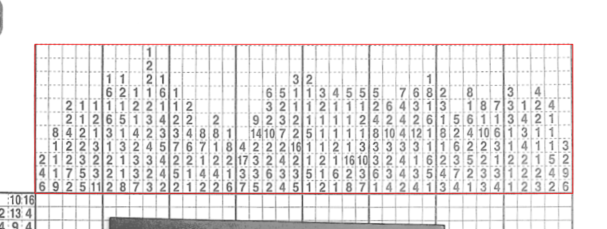
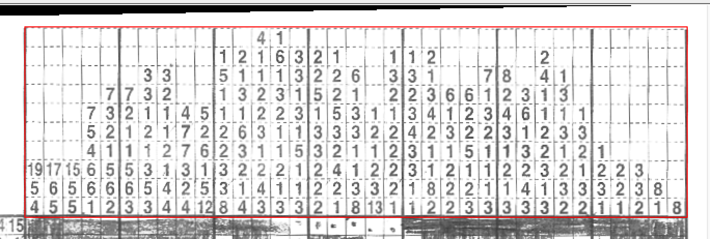
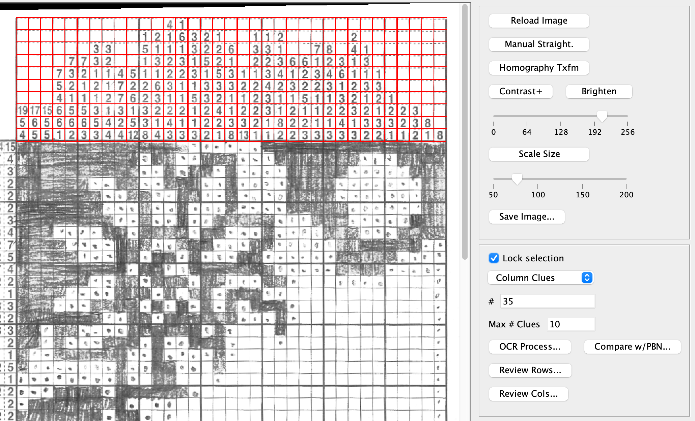
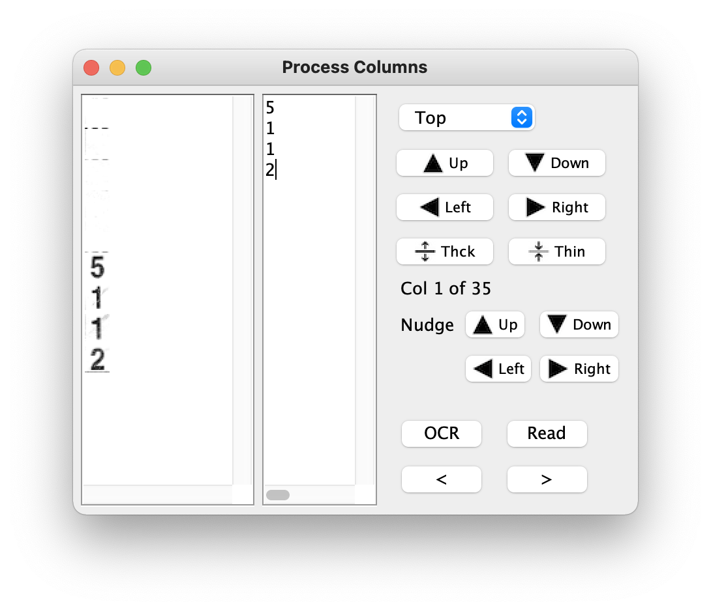
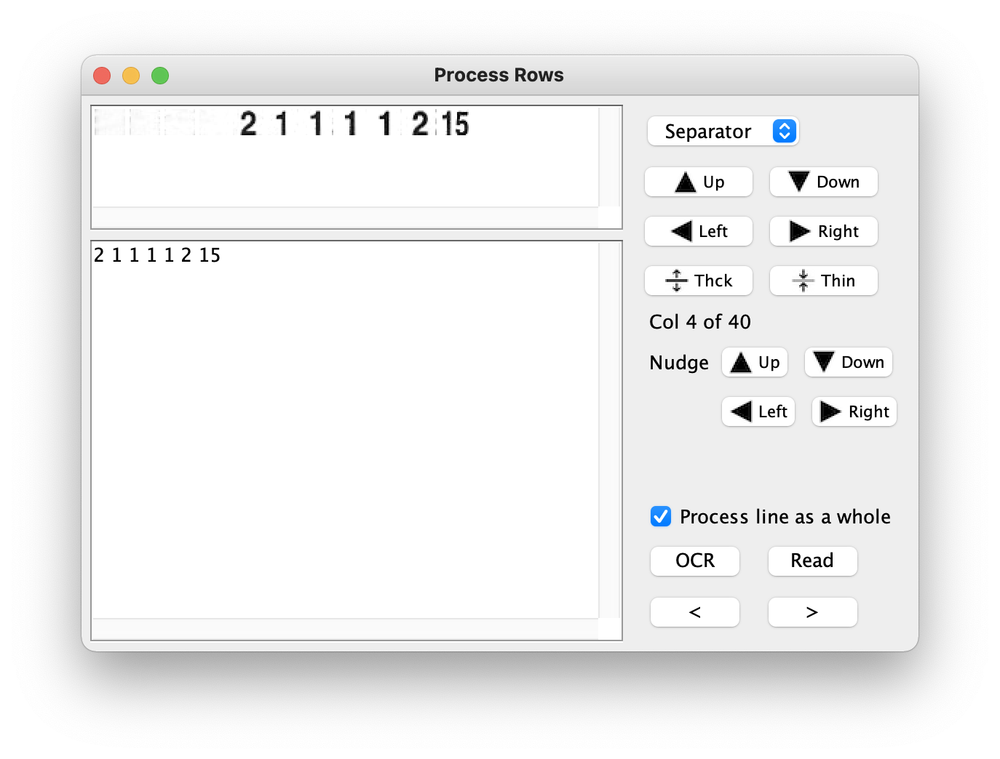
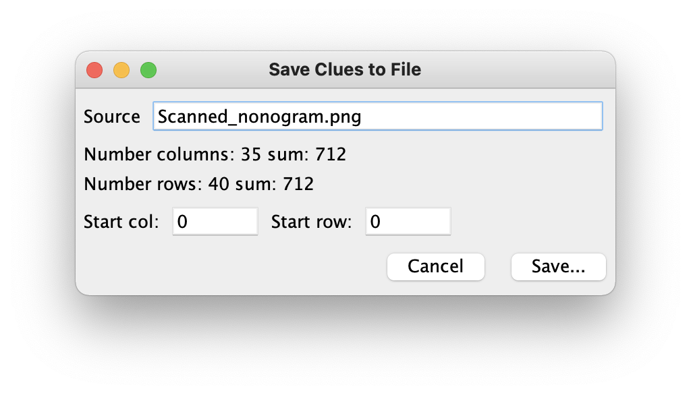
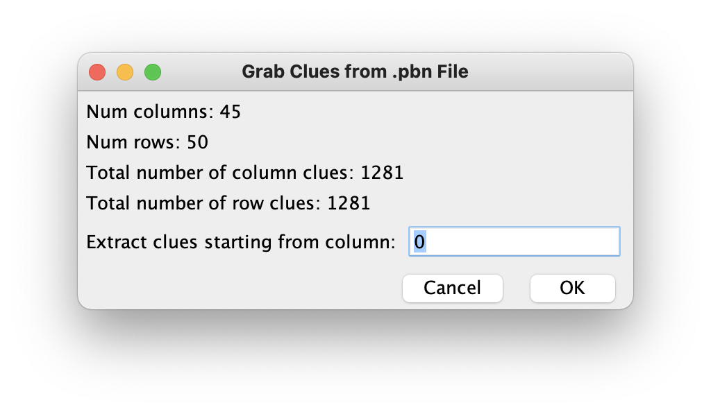

# PaintByNumber_OCR
Java program to scan a Nonogram .tiff (or other image format) and assist the user in extracting the puzzle clues using OCR and writing those clues into a text file format compatible with **PaintByNumberPro**.

Nonograms are also called Paint By Number, Griddlers, Hanjie, PicCross or Pic-a-Pix puzzles.

#paintbynumber #griddler #hanjie #piccross #picapix #interactive #autosolver

# Instructions for Use

## Getting Started
The `PaintByNumber_OCR.java` class file contains the main function to run.  You can either run this program through your IDE or your can double-click on the `PaintByNumber_OCR.jar` file in your `dist` folder.

## Importing the puzzle image

When you first run the program, you will be immediately asked to select an image to load.  You will have an easier time with the OCR processing if you use a flatbed scanner for your puzzle (or a screen capture).  You can take a photo of the puzzle, but the paper needs to be as flat as possible for good results.  And the lens distortion should be minimal.

Note that you do not need to scan in an entire puzzle all at once.  You can scan in portions of the clues and write out portions of the clues, combining them later into a single file to be used with **PaintByNumberPro**.

As a note, I've been scanning the puzzles in black and white at 200 dpi.  You can use photos, but you may need to scale them to a smaller size if they're too big to work with easily.  This can be done in this OCR program.

## Main Interface

After the image has been loaded, your main interface will look like this: 


## Preparing the image for OCR Processing

### Rotate the image

In this example, the image was scanned on a flatbed scanner and just needs to be rotated.  To do so, hold the SHIFT key and left-click-and-drag a line that needs to be made vertical:


Then click on the `Manual Straight.` button.

### Use homography transform

If you took a photo of your puzzle, then it likely needs more than just rotating to get the clues lined up in a nice rectangle.  Hold down the CTRL key and left-click the four corners of the area you would like to straighten out:


Then click on the `Homography Txfm` button.  Afterwards, your selected region should be straightened out and pre-selected for OCR processing:



### Scaling the image size

If the image is too big or too small to work with, you can scale the image using by setting the scaling slider (from 50% to 200%) and clicking on the `Scale Size` button.  You will see that scaling does affect the image contrast and brightness.  How to fix this is described later.

### Reloading the image

If at any time you feel you've messed something up, you can reload the image by selecting the `Reload` button and start over.

### Improving image contrast and brightness

If the image does not have enough contrast and is not bright enough (meaning the background is not white enough and the digits are not dark enough), the OCR process will have a more difficult time recognizing the clues.

When you choose the `Contrast+` button, the code brightens all pixels whose values are higher than the value on the greyscale slider (0-256) and darkens those values that are lower.

When you choose the `Brighten` button, the code brightens all pixels whose are higher than the selected value on the slider.

Between the these two options, you should be able to improve the contrast and brightness of your scanned image.

### Save the modified image

Hit the `Save image` button if you want to save the modified image into a new file.

## Extracting the Clues

### Selecting the Clues and Working with Large Puzzles

When you're ready to start extracting the clues, left-click-and-drag a rectangle around the bounding box of the clues.  You process the column clues separately from the row clues and are not required to do both in one session.  You will tell the program which ones you're selecting by choosing `Column Clues` or `Row Clues` from the drop down menu.



Note: For those really large puzzles, you sometimes need to scan portions of the clues and process them in sections.  Because the **PaintByNumberPro** file format (.pbn) is actually a text file, it is easy to save your clues into separate files and combine them later.  This OCR program will let you start your clues from any column or row that you specify.  For example, if you scanned clues for rows 0-89 separately from rows 90-179, then you can save the 2nd set of clues starting at row 90.  (Row or column numbers are included in the .pbn files).

On the right side of the window in the middle section, select `Column Clues` or `Row Clues` from the drop-down menu.  Then tell the program how many columns or rows to process and the maximum number of clues in each column or row.  Then press the `Lock selection` checkbox.  If the numbers are right, then it will look something like this:



Each clue should be neatly in its own box.  If you've got either of the numbers wrong, just uncheck the `Lock selection` checkbox, update the numbers, and lock it again.

### Processing Column Clues

Once you're ready, click on the `OCR Process...` button.  A window like the following appears:



For each column, the image of the column clues is extracted from the photo.  White lines are drawn at the top, bottom, left, right, and between each clue.  This should isolate the digits from the background and make it easier for the OCR function to recognize the numbers.  You can move those white lines around and make them thicker or thinner using the top 4 rows of controls.

Additionally, you can "nudge" the extraction box location within the photo in any direction.  This helps when there are distortions in the photo or scan of the puzzle and the locked rectangular grid does not match the clue locations.

If this is the first time the program has encountered these clues, it will run the OCR function on the image (shown on the left) and display what it read to the right.  Make any corrections needed.  For particularly long lists of clues, it is sometimes helpful to hear the clues being read to you.  Press the `Read` button to turn this on.  If you are annoyed by the sound of my voice, you can record and replace the audio files in the `src/audio` folder.  These files must have the same names and format as the originals.

If you want to run the OCR function again (say, after you nudged the extraction box or moved some of the white lines around), press the `OCR` button.

To move to the previous or next column, press the `<` or `>` button.  After you have processed all of the columns, the `Review Cols...` button should become enabled.  You can use this button to return to reviewing the column clues.  It also can be used to bring the `Process Columns` window to the front.

### Processing Row Clues

For row clues, you use the identical process as for column clues.  You identify the number of rows to process and the maximum number of clues per row. Then select the `Lock selection` checkbox.  If everything looks good, click on the `OCR Process...` button.  A window like the following appears:



This dialog behaves in similar fashion as the `Process Columns` dialog.  Of notable difference, the selected image can be processed as one image or it can be broken up into one image per clue.

If you choose to process the line as a whole (see the checkbox), then each digit encountered will be separated by a space.  This means that `15` will appear as `1` and `5` and you must remove the space in between.  This processing method is faster.

If you choose to process each clue separately, numbers such as `15` will hopefully be recognized as `15`.  However, this process is slower.

Sometimes one approach works better than the other.  You can try either one.  Click on the `OCR` button to rerun the OCR processing for that row.

After you have navigated through all of the rows, the `Review Rows...` button should become enabled.

### Saving the Clues

To save the clues to a .pbn file, readable by the **PaintByNumberPro** program, click on the `Save Clues` button.  The following dialog appears:



The `Source` text field is where you can list the source of the scanned puzzle.  For example, it could be the 1st puzzle from a book of nonograms you could call this "nonogram_book_puzzle_1".  The default value is the name of the scanned image that you've just processed.

The total number of columns and rows are noted as is the sum of all the clue values for each set of clues.  If they're different, then there is an error and you need to double-check the clues against the scanned puzzle.

The start column and row are provided as a convenience for when you are scanning and processing portions of a puzzle.  For example if you processed rows 90 to 179 only with no column clues, you can still save the row clues in its own file and combine it with the other clues later using any text editor.  You tell the program that you're starting with row 90 by setting the `Start row` text field to 90.  If you fail to do this, then you will have to manually edit all of the row numbers within the .pbn file.

Click the `Save` button when you're ready to choose a .pbn file to write the clues to.

## Format of a .pbn File

The format of a .pbn file is simple.  It looks like this:
```
Source	Nonogram Book Puzzle 1
Rows	25
Cols	30
Row_clues	0	1	27
Row_clues	1	3	7	14	3
Row_clues	2	5	6	1	1	11	3
Row_clues	3	7	1	4	1	1	9	2	3
...
Row_clues	24	5	3	1	2	4	2
Col_clues	0	1	1
Col_clues	1	4	13	1	1	3
Col_clues	2	4	18	1	1	1
Col_clues	3	6	3	1	2	6	3	1
Col_clues	4	4	4	1	2	4
...
Col_clues	29	2	18	6

``` 
(The ... indicates that there are lines not shown).  The first line contains the Source of the puzzle and is contains arbitrary text.  The second and third lines tell you how many rows and columns there are in the puzzle.  These are followed by the row clues and then the column clues.  The 1st digit after `Row_clues` or `Col_clues` is the row or column number.  It is followed by the number of clues for that row or column.  And lastly come the clue values.  Please keep these items in the order shown as the **PaintByNumberPro** program that reads the file is not particularly flexible.

## Checking a .pbn File

It often happens that the .pbn file created by this program still contains small typos.  When this occurs, you can choose to compare a scanned puzzle with an existing .pbn file.

To do this, first select your column or row clues as usual and lock the selection.  Then click on the `Compare w/PBN...` button.  Select the .pbn file to load.  Then the following dialog will appear:



The example shown is for locked column clues.  The dialog is similar for locked row clues.

The .pbn file is read in and the number of columns and rows are reported as are the sum of the clue values for the clues in each direction.  If these numbers do not match, then there is an error with the clues.

In the text field, you can tell the program which column or row of clues you want to start with to compare with the selected clues in the scanned image.

Once you have selected the starting column or row, click on the `OK` button and the usual dialog for comparing and/or processing the scanned clues will appear.  You can cycle through the clues looking for any errors and correcting them.

After you have found your errors and made the appropriate corrections, click on the `Save PBN...` button to write out a new .pbn file.  This will write out the full .pbn file rather than just the clues that have been examined and corrected.

# Dependencies

This program uses code from the **PaintByNumberPro** project to read and write the .pbn files.  Thus, one of its libraries is the `PaintByNumberPro.jar` file.  Please see my other repository for that program.

The other dependencies are for Tesseract OCR and for OpenCV.  These are described in more detail in the next section.

# Development Environment
This program was developed on an Intel 2016 MacBook Pro using Java 8 and NetBeans 8.2.

To find Java 8 JDKs for Mac and PC, click here [Java 8 Archive](https://www.oracle.com/java/technologies/javase/javase8u211-later-archive-downloads.html).  To find NetBeans 8.2 for PC, you can find it here [lucky link to NetBeans 8.2](https://softfamous.com/netbeans-ide/).  For the Mac, it may be possible to install older versions of NetBeans using homebrew:

```
brew tap homebrew/cask-versions
brew search netbeans
brew info --cask netbeansXX
brew install --cask netbeansXX
```

where `netbeansXX` is the version you are looking to install.  `brew search netbeans` returns a list of available casks related to netbeans.  When I tried this on my Mac, I see that only the latest version 12.5 is available.

## Installing Tesseract OCR for Mac or PC with Java Interface
Tesseract OCR is used for extracting the puzzle clues from the scanned Nonogram.  It seems that I have the native library installation via homebrew and the Java interface from Tess4J.  I believe I downloaded Tess4J from SourceForge here: [SourceForge Tess4J download](https://sourceforge.net/projects/tess4j/).  And my homebrew version is 4.1.0.  There are newer versions of Tesseract available now (v5) and I'm not sure if Tess4J will work with these newer versions.

## Tess4J and NetBeans
Once you download the Tess4J package, you'll see the following folders:

- dist (contains the .jar file you need)
- lib (contains all the other .jar files you need plus the native libraries)
- nbproject
- src
- tessdata (contains the English training data you need, though I used the training data installed by homebrew)
- test

The Tess4J folder is configured as a NetBeans project.  In NetBeans, you can load the Tess4J folder as a project.  In theory, you should be able to run the JUnit tests by right-clicking on the project icon and select "Test...".  This worked flawlessly on my PC as long as I did not store the Tess4J folder on my OneDrive folder (which has spaces in the full path name).  I'm not sure if it was the spaces in the folder that mattered or if the fact that it was stored in the cloud that mattered.

On my Mac, Tess4J does not contain the appropriate native libraries.  But I was able to install tesseract using homebrew.  So I am able to use the Java interfaces from Tess4J with the tesseract native libraries in homebrew without having to set up the java.library.path on the JVM command line.  (I'm probably also using a conveniently compatible version of tesseract).  I was not able to run the JUnit tests on my Mac for some reason because it could not find the native libraries. I have not pursued fixing this problem because my code was working.

Note that for this program, **PaintByNumber_OCR**, you can set the TessDataLocationDefault static String in `PaintByNumber_OCR.java` for your system.  The other option is to provide the tessdatapath property in the "Run" "VMOptions:" (e.g. `-Dtessdatapath=<your_local_path_to_tessdata>`).

## Tesseract Example in Java / NetBeans
Here is a quick example of how to use Tesseract OCR in Java.  You can create this sample program within the Tess4J Netbeans project and see if it will run.

```
package sample_program;

import java.awt.image.BufferedImage;
import java.awt.FileDialog;
import java.awt.Graphics;
import java.io.FilenameFilter;
import java.io.File;
import java.io.IOException;
import javax.imageio.ImageIO;
import net.sourceforge.tess4j.Tesseract;
import net.sourceforge.tess4j.TesseractException;

public class Tess4J_Example {
    
    public Tess4J_Example()
    {
        final String[] formats = ShowImageIOInfo();        
	    
        // ---- Have user select a TIFF image ----
        FileDialog fd = new FileDialog((java.awt.Frame) null, "Select a TIFF image for OCR", FileDialog.LOAD);
        fd.setFilenameFilter (new FilenameFilter ()
        {
            public boolean accept (File f, String name)
            {
                String extension = name.substring(name.lastIndexOf("."));
                if (extension == null) return false;
                for (int i=0; i<formats.length; i++)
                    if (extension.compareTo ("." + formats[i]) == 0) return true;
                return false;
            }
        });
        fd.setVisible(true);
        if (fd.getFile() == null) return;
        File f = new File(fd.getDirectory(), fd.getFile());
		
        // ---- Read image ----
        BufferedImage color_img = null, grey_img = null;
        try
        { color_img = ImageIO.read(f); } 
        catch (IOException ie)
        {
            System.out.println ("IOException: " + ie.getLocalizedMessage());
            return;
        }        
        if (color_img == null) return;
		
        // ---- Convert to greyscale ----
        grey_img = new BufferedImage(color_img.getWidth(), color_img.getHeight(), BufferedImage.TYPE_BYTE_GRAY);  
        Graphics g = grey_img.getGraphics();  
        g.drawImage(color_img, 0, 0, null);  
        g.dispose();  		
		
        // ---- Set up Tesseract and run the OCR ----
        Tesseract tess = new Tesseract();
        tess.setDatapath("/usr/local/Cellar/tesseract/4.1.1/share/tessdata");	
        tess.setTessVariable("tessedit_char_whitelist", "0123456789");
        try
        {
            String ocr_out = tess.doOCR (grey_img);      
            System.out.println ("OCR output: " + ocr_out);
        }
        catch (TesseractException tioe)
        { System.out.println ("TesseractException: " + tioe.getLocalizedMessage()); }
    }
    
    public String[] ShowImageIOInfo () {
        String[] formats = ImageIO.getReaderFormatNames();
        for (int i = 0; i < formats.length; ++i) {
          System.out.println("reader " + formats[i]);
        }

        String[] names = ImageIO.getWriterFormatNames();
        for (int i = 0; i < names.length; ++i) {
          System.out.println("writer " + names[i]);
        }
        
        return formats;
    }        
    
    /*======================================*
    * Entry Point                          *
    *======================================*/

    public static void main(String[] args)
    {   
        Tess4J_Example te = new Tess4J_Example();
    }
}
```

## Installing OpenCV for Mac or PC with Java Interfaces
On a PC, it is easy to get OpenCV with Java interfaces.  Click on this link [OpenCV Releases](https://opencv.org/releases/) to download the complete package for OpenCV.  The Java interfaces are contained within the build/java folder and the native libraries are in the build/java/x86 and build/java/x64 folders.

Getting OpenCV installed on my Intel MacBook Pro was a little more difficult.  You can use homebrew to install OpenCV, but it no longer supports building the Java interfaces.  So I ended up trying to install OpenCV from source and building it locally on my machine.  I used instructions from here: [OpenCV 4 with Java instructions](https://delabassee.com/OpenCVJava/) by David Delabassée.

I already had XCode and Java 8 installed on my Mac so I started with creating a landing space for OpenCV and downloading the source from GitHub:

```
mkdir workspace;cd workspace
git clone https://github.com/opencv/opencv.git
mkdir build
```

I used ccmake to create the make file.

```
ccmake -S opencv/ -B build/
```

Following the directions, navigate through the various options using the "j" and "k" keys (or your scroll wheel) for moving down and up through the options.  Options can be turned on and off by hitting the space bar or edited by hitting Enter.  Press "t" to enter Advanced Mode.  Advanced Mode was necessary to be able to configure some of the more obscure settings for Java.  Be sure to set the Java environment variables noted on the webpage.  After you have chosen your settings, type "c" to configure.

David Delabassée has a list of suggested modules to omit for a faster build and for just getting started.  I did try building the image codecs and calib3d, but was not able to get it to actually build, having run into some kind of problem with building zlib.  If I use only the basics of OpenCV, I can get the whole thing to build.  But anything requiring zlib is a problem.  UPDATE: this [OpenCV config reference](https://docs.opencv.org/4.5.3/db/d05/tutorial_config_reference.html) was very helpful.  It clued me into the fact that enabling "BUILD_ZLIB" meant that I wanted to build zlib from source (from the 3rdparty folder).  I had zlib already installed with homebrew, so when I turned this option off, OpenCV was built successfully.  Yay!

When you have finished setting up your options and the configuration executes without error, press "g" to generate the Makefile.  Any errors in your configuration will be noted with an asterisk (*).

Once the Makefile is generated, exit ccmake and then build OpenCV using:

```
cmake --build build
```

Presumably all goes well and you now have OpenCV native libraries and the Java Native Interface to work with.  The .jar file should be in the build/bin folder and the native library files should be in build/lib.

## OpenCV and NetBeans
Now that OpenCV and it's Java bindings have been built, you need to add the `opencv-453.jar` library to the list of Libraries for the project.  And you add `-Djava.library.path=/Users/Lynne/Documents/OpenCV/build/lib` to the "Run" "VM Options:" Project Preferences.

## OpenCV Example in Java / NetBeans
There are two examples of using OpenCV in this program.  One is not used, but is in `Puzzle_JFrame.java` and is the `AutoCalculateRotation` method.  It computes an FFT.

The other example is of calculating and applying a homography transform.  The setup for the data needed for the homography transform is in `Puzzle_JFrame.java` in the `HomographyJButtonActionPerformed` method.  The actual computation of the transform is in the `ImageComponent.setHomography` method.  The application of the transform occurs in the `ImageComponent.ApplyAllTransforms` method.  A good reference for how to do the homography transform was found [here](https://docs.opencv.org/4.5.3/d9/dab/tutorial_homography.html).
